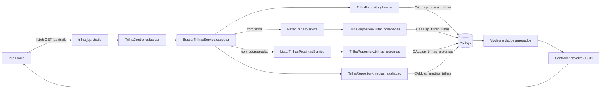

# Fluxograma — buscar e filtrar trilhas

```mermaid
flowchart LR
  A[Tela Home] -->|fetch GET /api/trails| B[trilha_bp: /trails]
  B --> C[TrilhaController.buscar]
  C --> D[BuscarTrilhasService.executar]
  D --> E[TrilhaRepository.buscar]
  E -->|CALL sp_buscar_trilhas| F[(MySQL)]
  D -->|com filtros| G[FiltrarTrilhasService]
  G --> H[TrilhaRepository.listar_ordenadas]
  H -->|CALL sp_filtrar_trilhas| F
  D -->|com coordenadas| I[ListarTrilhasProximasService]
  I --> J[TrilhaRepository.trilhas_proximas]
  J -->|CALL sp_trilhas_proximas| F
  D --> K[TrilhaRepository.medias_avaliacao]
  K -->|CALL sp_medias_trilhas| F
  F --> L[Models e dados agregados]
  L --> M[Controller devolve JSON]
  M --> A
```

A proximidade é calculada a partir das coordenadas enviadas pelo navegador; não usa a localização atual sem consentimento do navegador.
