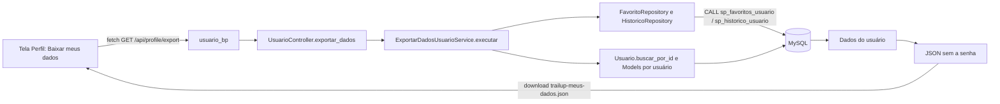

# Fluxograma — exportar meus dados

```mermaid
flowchart LR
  A[Tela Perfil: Baixar meus dados] -->|fetch GET /api/profile/export| B[usuario_bp]
  B --> C[UsuarioController.exportar_dados]
  C --> D[ExportarDadosUsuarioService.executar]
  D --> E[Usuario.buscar_por_id e Models por usuário]
  D --> F[FavoritoRepository e HistoricoRepository]
  F -->|CALL sp_favoritos_usuario / sp_historico_usuario| G[(MySQL)]
  E --> G
  G --> H[Dados do usuário]
  H --> I[JSON sem a senha]
  I -->|download trailup-meus-dados.json| A
```
