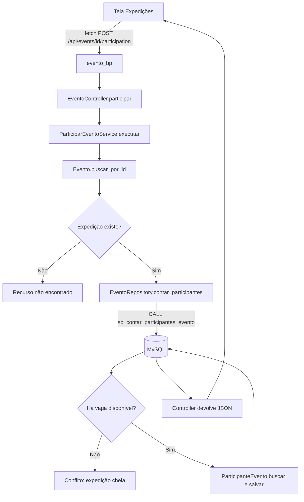

# Fluxograma — participar de expedição

```mermaid
flowchart TD
  A[Tela Expedições] -->|fetch POST /api/events/id/participation| B[evento_bp]
  B --> C[EventoController.participar]
  C --> D[ParticiparEventoService.executar]
  D --> E[Evento.buscar_por_id]
  E --> F{Expedição existe?}
  F -- Não --> X[Recurso não encontrado]
  F -- Sim --> G[EventoRepository.contar_participantes]
  G -->|CALL sp_contar_participantes_evento| H[(MySQL)]
  H --> I{Há vaga disponível?}
  I -- Não --> Y[Conflito: expedição cheia]
  I -- Sim --> J[ParticipanteEvento.buscar e salvar]
  J --> H
  H --> K[Controller devolve JSON]
  K --> A
```

O Service também verifica duplicidade antes de gravar a participação. A rota exige sessão autenticada.
