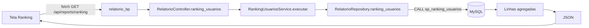

# Fluxograma — consultar ranking

```mermaid
flowchart LR
  A[Tela Ranking] -->|fetch GET /api/reports/ranking| B[relatorio_bp]
  B --> C[RelatorioController.ranking_usuarios]
  C --> D[RankingUsuariosService.executar]
  D --> E[RelatorioRepository.ranking_usuarios]
  E -->|CALL sp_ranking_usuarios| F[(MySQL)]
  F --> G[Linhas agregadas]
  G --> H[JSON]
  H --> A
```
